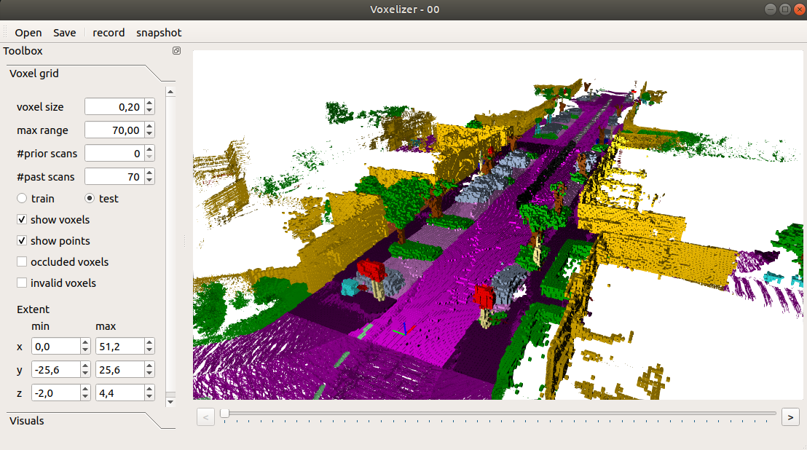

# Voxelize point clouds

 Tool to voxelize annotated point clouds. 
 
 
 
## Dependencies

* Eigen >= 3.2
* boost >= 1.54
* QT >= 5.2
 
## Build
  
On Ubuntu 22.04/20.04, most of the dependencies can be installed from the package manager:
```bash
sudo apt install build-essential cmake libeigen3-dev libboost-all-dev qtbase5-dev libglew-dev
```

Use the usual cmake out-of-source build process:
```bash
mkdir build && cd build
cmake ..
```
Now the project root directory should contain a `bin` directory containing the voxelizer.

## Usage


In the `bin` directory, just run `./voxelizer` to start the voxelizer. 


In the `settings.cfg` files you can change the followings options:

<pre>
max scans: 500    # number of scans to load for a tile. (should be maybe 1000), but this currently very memory consuming.
min range: 2.5    # minimum distance of points to consider.
max range: 50.0   # maximum distance of points in the point cloud.
ignore: 0,250,251,252,253,254  # label ids of labels that should be ignored when building a voxelgrid.
</pre>

To generate the data by iterating over a sequence directory, call `./gen_data` in the `bin` directory.


 
## Folder structure

When loading a dataset, the data must be organized as follows:

<pre>
point cloud folder
├── velodyne/             -- directory containing ".bin" files with Velodyne point clouds.   
├── labels/               -- label directory, will be generated if not present.    
├── calib.txt             -- calibration of velodyne vs. camera. needed for projection of point cloud into camera.  
└── poses.txt             -- file containing the poses of every scan.
</pre>
